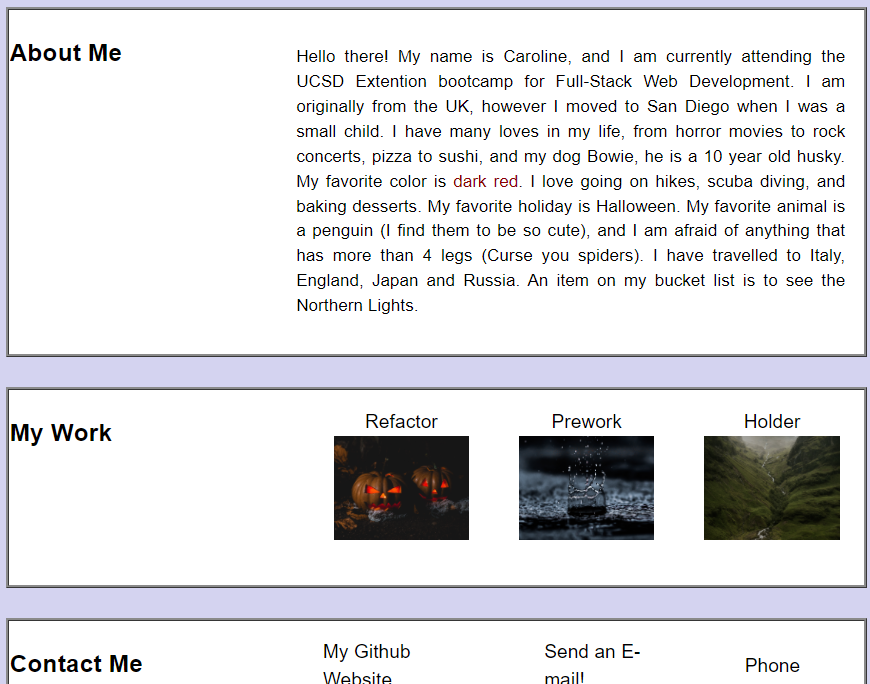
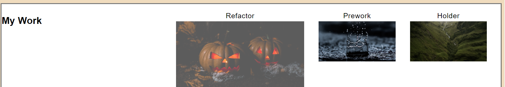

# My Profile

## About This Project

I worked on this project to practice flexbox, play with what I can do with pseudo-classes, and how to work with keyframes. I was able come up with and test many different aspects of how to format the site, practice with formatting different elements within their parent containers, and hit walls on what I was able to do. I did a LOT of googling, but I listed the sites that were fundamental to me making the site what it is. I know that I will have some further issues as I try to expand upon this project in the future, however I am very excited to try and make this site more usable and expand my knowledge more!

Originally I made my profile site completely differently that what it is now. I ended up moving the keyframes to the body of the site, to make it less straining on the eyes, I kept with lighter colors to avoid any accessablility issues.
From there I made my height and width measurements for everything that I could based on viewport heigth and width respectively- this allowed for a more responsive website. 
I bumped into the issue of overflow a few times, and my child elements going beyond the parent container. Playing around with overflow settings and border-sizing allowed me to clear through most of those issues. 
Towards the end I realized that I needed images as anchors, so I had to play around with my list items a bit to get the desired effects.
The pseudo-class hover was a blast to work with! I played with image sizes, text sizing, and opacity. There are a few more things I wish to play around with, but that might be for another time. 

### Built With
- HTML
- CSS
- Visual Studio Code
- Coffee (Thanks Nespresso!)

### Contact 
project link: (https://cpastorelli.github.io/myProfile/)
profile link: (https://cpastorelli.github.io)

## Acknowledgements
- [Hex Color Codes](https://www.color-hex.com/)
- [Border-Radius](https://www.w3schools.com/cssref/css3_pr_border-radius.asp)
- [Transitions](https://developer.mozilla.org/en-US/docs/Web/CSS/CSS_Transitions/Using_CSS_transitions)
- [Attaching_Screenshots](https://stackoverflow.com/questions/14494747/how-to-add-images-to-readme-md-on-github)
- [IMG_Pumpkin](https://www.pexels.com/photo/two-jack-o-lantern-lamps-619418/)
- [IMG_Misty_Mountain](https://www.pexels.com/photo/green-mountain-with-river-in-the-middle-4064432/)
- [IMG_Rain_Drop](https://www.pexels.com/photo/water-droplet-digital-wallpaper-1100946/)
- [Image-resizing](https://stackoverflow.com/questions/19414856/how-can-i-make-all-images-of-different-height-and-width-the-same-via-css)
- [Centering-image-in-list-item](https://stackoverflow.com/questions/29848553/how-to-center-image-in-li-elements)